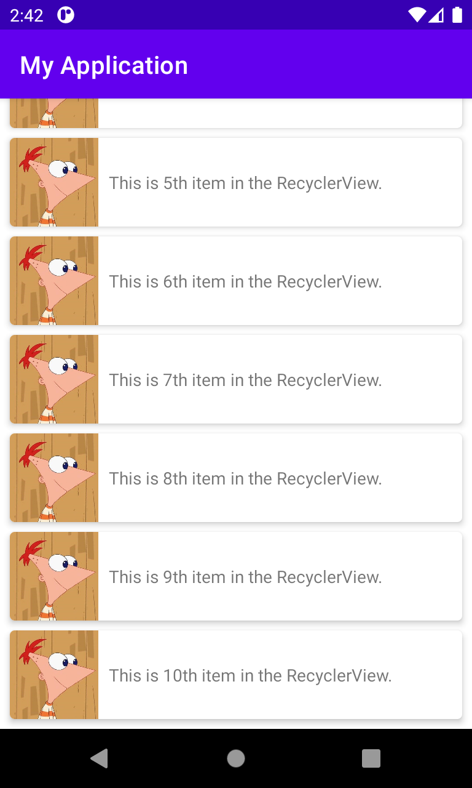
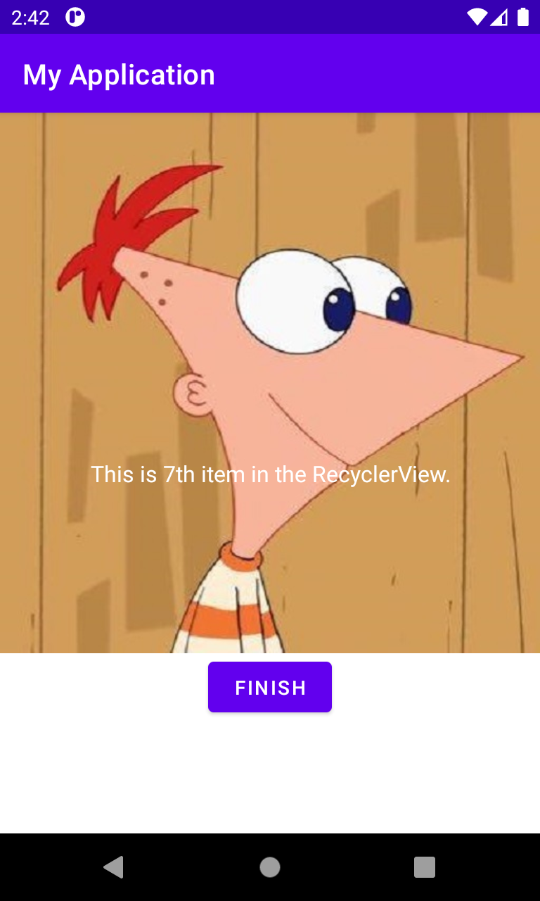

Just a personal repository to keep Native Android apps made in Java/Kotlin while learning.

I'm already proficient in Flutter & hopefully maintain few plugin and apps for the community. I've started to learn Java/Kotlin & Native Android development to increase the domain of my skills.

## Applications

### [Tip Time](https://github.com/alexmercerind/native-android-journey/tree/master/TipTime)

- `findViewById`
- `setOnClickListener`
- `setOnCheckedChangeListener`
- `ConstraintLayout`
- `Switch`
- `TextView`
- `EditText`
- `Button`
- `RadioGroup`
- `RadioButton`
- Baseline constraints

</img>

### [Affirmations](https://github.com/alexmercerind/native-android-journey/tree/master/Affirmations)

- `RecylerView`
  - Scrollable elements that render upon request.
- `RecyclerView.Adapter`
  - Extend the custom `RecylerView` elements.
- `RecyclerView.ViewHolder`
  - Extend it & do `findViewById`.
- `MaterialCardView`
- `LinearLayout`
  - Works like Flutter's Flex, `android:orientation="vertical"` etc.
- `FrameLayout`
  - For single child.
- `app:layoutManager="LinearLayoutManager"`

</img>

### [Intents](https://github.com/alexmercerind/native-android-journey/tree/master/Intents)

- `new Intent(context, Activity.class)`
- `context.startActivity(intent)`
- `intent.putExtra(name, value)`
- `intent.getStringExtra(name)` etc.
- `finish()`
- `context.startActivityForResult(intent)`
- `finishActivity((int)result)`

| | |
|-|-|
|||
